# SIH26101: AI-Enabled Skill Intelligence & Learning Platform for India's Official Statistical System
## Integrated with iGOT Karmayogi & NSSTA TPAC Framework | Sleek Coursera-Inspired Monochromatic UI

---

## 1. Executive Summary & Problem Scope

### 1.1 Problem Statement Overview
India's Official Statistical System—anchored by the **Ministry of Statistics and Programme Implementation (MoSPI)**, the **National Statistical Office (NSO)**, and the **National Statistical Systems Training Academy (NSSTA)**—is undergoing monumental modernization. The shift encompasses modern data science, Big Data, Machine Learning, Geospatial Information Systems (GIS), automated survey processing, National Accounts revision, and high-frequency economic indicator computation.

However, existing capacity building mechanisms face significant bottlenecks:
1. **Competency Opacity**: Officers and statistical personnel lack a standardized, dynamic diagnostic system to measure their current competencies against evolving job role benchmarks.
2. **Catalog Discovery Paradox**: While the **iGOT Karmayogi** (Mission Karmayogi - NPCSCB) platform hosts thousands of courses, statistical officers struggle to filter and identify targeted courses matched to their cadre, division, and career progression.
3. **Absence of Unified Statistical Domain Mapping**: Traditional generic LMS platforms do not incorporate official statistical domain frameworks (e.g., UN Fundamental Principles of Official Statistics, National Accounts System, NSSO sampling designs, CPI/WPI price indices, SDG Localization).
4. **Assessment & Question Creation Burden**: Faculty at NSSTA and departmental trainers spend hundreds of manual hours formulating multiple-choice questions (MCQs), case studies, and quizzes from dynamic government statistical reports, manuals, and committee whitepapers.

### 1.2 The Solution: "Karmayogi Sankhyiki" (AI Skill Intelligence & Learning Platform)
An enterprise-grade, AI-driven Learning & Skill Intelligence Platform specifically tailored for India's Official Statistical System. The system:
- Ingests learner profiles across cadres (Indian Statistical Service - ISS, Subordinate Statistical Service - SSS, Field Operations Division - FOD investigators, Data Processing Division - DPD analysts).
- Diagnoses multi-dimensional competency gaps against a standardized **FRAC (Framework for Roles, Activities, and Competencies)** dictionary.
- Delivers a dual-track personalized recommendation engine integrating both **iGOT Karmayogi digital e-learning modules** and **NSSTA TPAC (Training Programme Approval Committee)** approved residential/blended training programs.
- Provides a **Multimodal AI-Powered Assessment & Adaptive (CAT) Quiz Engine** that automatically parses uploaded statistical documents (PDFs, Word docs, PowerPoint presentations, and Video/Audio transcripts) and produces high-validity MCQs classified across Bloom's Taxonomy with distractor rationales and page citations.
- Features **"Sankhyiki Mitra"**, a bilingual (English & Hindi) conversational RAG assistant with speech/voice support grounded in MoSPI manuals and guidelines.
- Issues **MoSPI Digital Skill Passports & QR-Verified Credentials** for officers upon clearing competency benchmarks.
- Provides **Supervisor Team Skill Matrices** and high-impact interactive dashboards for individual learners and cadre administrators with predictive capacity planning analytics and automated PDF export reports.

---

## 2. Multi-Dimensional Competency Framework for Official Statistics

The platform codifies competencies across **4 Core Domains** structured into 5 proficiency levels:
- **Level 1 (Novice)**: Basic awareness of terminology and concepts.
- **Level 2 (Foundational)**: Ability to execute routine tasks under supervision.
- **Level 3 (Competent)**: Independent execution of standard statistical methodologies.
- **Level 4 (Proficient)**: Ability to design methodologies, resolve anomalies, and guide teams.
- **Level 5 (Expert / Master)**: National/International authority, policy formulation, novel framework development.

### 2.1 Domain 1: Statistical Competencies (STAT)
| Code | Competency Name | Description & Key Topics | Target Cadres |
|---|---|---|---|
| `STAT-SURV` | Survey Design & Sampling Methodologies | Multi-stage stratified sampling, probability proportional to size (PPS), sample size estimation, sampling/non-sampling errors, NSSO design. | SSS, ISS, Field Surveyors |
| `STAT-NAS` | National Accounts Statistics | SNA 2008 / 2025 frameworks, GVA/GDP compilation, Supply and Use Tables (SUT), informal sector estimation, institutional sectors. | ISS (NAD), Macro Analysts |
| `STAT-PRICE` | Price Statistics & Indices | Consumer Price Index (CPI), Wholesale Price Index (WPI), Index of Industrial Production (IIP), chaining, item basket weighting, Laspeyres/Paasche/Fisher indices. | SSS, ISS (ESD) |
| `STAT-LABOUR` | Labour & Employment Statistics | Periodic Labour Force Survey (PLFS), Usual Status vs. CWS methodologies, worker-population ratios, labour force participation rates (LFPR). | SSS, ISS |
| `STAT-AGRI` | Agricultural & Rural Statistics | Agricultural Census, crop cutting experiments, yield estimation, land-use statistics, rural price monitoring. | Field Officers, SSS |
| `STAT-INDUS` | Industrial & Enterprise Statistics | Annual Survey of Industries (ASI), factory sector sampling, enterprise surveys, formal vs. informal business registries. | SSS, ISS |
| `STAT-SDG` | SDG Indicators & Localization | National Indicator Framework (NIF), State Indicator Framework (SIF), metadata reporting, data disaggregation, leave-no-one-behind metrics. | ISS, State DES Officers |
| `STAT-DQAF` | Data Quality Assurance Framework | UN Data Quality Framework, MoSPI DQAF, validation rules, plausibility checks, imputation methodologies, metadata standards (SDMX, DDI). | All Statistical Officers |

### 2.2 Domain 2: Technical & Computational Competencies (TECH)
| Code | Competency Name | Description & Key Topics | Target Cadres |
|---|---|---|---|
| `TECH-PYST` | Python for Statistical Computing | Pandas, NumPy, SciPy, Statsmodels, automated validation scripts, large-scale data cleaning pipelines. | Analysts, SSS, ISS |
| `TECH-RPRG` | R Programming & Econometrics | Tidyverse, survey package for complex survey designs, seasonal adjustments (X-13ARIMA-SEATS), econometric modeling. | SSS, ISS, Research Officers |
| `TECH-DBQL` | SQL & Database Management | PostgreSQL, query optimization, handling relational census/survey databases, data warehousing, OLAP cubes. | Data Processing Units |
| `TECH-STSP` | Statistical Software (Stata/SPSS/SAS)| Microdata extraction, survey weighting application, ANOVA, multivariate regression, cross-tabulations. | Data Processing, NSSTA Faculty |
| `TECH-GIS` | Geospatial Analytics & GIS | QGIS, ArcGIS, Bhuvan integration, spatial sampling frames, geospatial stratification, thematic mapping of indicators. | Field Supervisors, ISS |
| `TECH-VIZ` | Data Visualization & Storytelling | Power BI, Tableau, Plotly, D3.js, interactive dashboards, infographics for parliamentary/policy dissemination. | Dissemination Division, ISS |
| `TECH-AIML` | AI/ML in Official Statistics | Automated missing value imputation, NLP on textual survey responses, satellite imagery for crop yield, time-series forecasting. | Advanced Analytics Division |
| `TECH-OPEN` | Open Data & APIs | API development, CKAN platform, Open Government Data (data.gov.in) standards, automated dissemination feeds. | IT Division, ISS |

### 2.3 Domain 3: Digital Governance & Data Stewardship (GOV)
| Code | Competency Name | Description & Key Topics | Target Cadres |
|---|---|---|---|
| `GOV-CYBER` | Information Security in Gov Systems | Cyber hygiene, CERT-In advisories, data encryption, access controls, incident reporting. | All Personnel |
| `GOV-DPDP` | Data Privacy & DPDP Act 2023 | Digital Personal Data Protection Act compliance, anonymization, differential privacy, statistical disclosure limitation. | Cadre Officers, Supervisors |
| `GOV-MEGH` | MeghRaj & Gov Cloud Infrastructure | Government Cloud deployment, elasticity, containerization, security auditing, multi-tenant databases. | Technical Teams |
| `GOV-DPI` | Digital Public Infrastructure & e-Sign | Aadhaar e-KYC, e-Sign, DigiLocker, integration with government registries, e-Office protocols. | Administrative Staff, ISS |

### 2.4 Domain 4: Behavioural & Managerial Competencies (MGMT)
| Code | Competency Name | Description & Key Topics | Target Cadres |
|---|---|---|---|
| `MGMT-LEAD` | Statistical Leadership & Strategy | Vision setting, international representation (UNSD, ESCAP), inter-ministerial data coordination. | Director, DDG, DG |
| `MGMT-COMM` | Communication & Dissemination | Communicating statistical uncertainty, media briefings, writing executive summaries for Cabinet notes. | ISS Officers |
| `MGMT-PROJ` | Project & Survey Management | Managing large-scale nationwide field operations, budget tracking, milestone monitoring, vendor SLA management. | DD, Director, DDG |
| `MGMT-ETHC` | Statistical Ethics & UN Principles | UN Fundamental Principles of Official Statistics, integrity, political neutrality, confidentiality assurance. | All Statistical Personnel |

---

## 3. Cadre & Role Target Competency Matrices

The system includes pre-configured benchmark profiles for key designations:

### 3.1 Junior Statistical Officer (JSO) / Subordinate Statistical Service (SSS)
- `STAT-SURV`: Level 3 (Competent)
- `STAT-PRICE`: Level 3 (Competent)
- `STAT-DQAF`: Level 3 (Competent)
- `TECH-PYST`: Level 2 (Foundational)
- `TECH-DBQL`: Level 2 (Foundational)
- `GOV-CYBER`: Level 2 (Foundational)
- `MGMT-ETHC`: Level 3 (Competent)

### 3.2 Senior Statistical Officer (SSO)
- `STAT-SURV`: Level 4 (Proficient)
- `STAT-LABOUR`: Level 3 (Competent)
- `STAT-INDUS`: Level 3 (Competent)
- `TECH-RPRG`: Level 3 (Competent)
- `TECH-GIS`: Level 3 (Competent)
- `GOV-DPDP`: Level 3 (Competent)
- `MGMT-PROJ`: Level 3 (Competent)

### 3.3 Assistant Director / Deputy Director (ISS)
- `STAT-NAS`: Level 3 (Competent)
- `STAT-SDG`: Level 4 (Proficient)
- `STAT-DQAF`: Level 4 (Proficient)
- `TECH-AIML`: Level 3 (Competent)
- `TECH-VIZ`: Level 4 (Proficient)
- `MGMT-COMM`: Level 4 (Proficient)
- `MGMT-PROJ`: Level 4 (Proficient)

### 3.4 Director / Deputy Director General (ISS Senior Leadership)
- `STAT-NAS`: Level 5 (Master)
- `STAT-SDG`: Level 5 (Master)
- `GOV-DPDP`: Level 5 (Master)
- `MGMT-LEAD`: Level 5 (Master)
- `MGMT-COMM`: Level 5 (Master)
- `MGMT-ETHC`: Level 5 (Master)

---

## 4. End-to-End System Architecture

```mermaid
flowchart TB
    subgraph ClientLayer["Frontend & Client Interfaces (Coursera-Inspired Next.js 14)"]
        LD["Learner Hub\n(Radar Chart, Gaps, Pathways)"]
        SD["Supervisor Dashboard\n(Team Matrix & Nominations)"]
        AD["Admin Dashboard\n(Division Heatmaps, TPAC Planner)"]
        QG["Multimodal Assessment Studio\n(PDF/PPTX/Video, Adaptive CAT)"]
        CT["Sankhyiki Mitra\n(Voice & Text Bilingual AI Tutor)"]
        SP["Digital Skill Passport\n(QR-Verified Credentials & PDF Export)"]
    end

    subgraph APILayer["API Gateway & Services (FastAPI + Async Python)"]
        AuthSvc["Auth & RBAC Service\n(JWT, iGOT Parichay SSO)"]
        ProfSvc["Profile & Cadre Service\n(FRAC Matrix, Supervisor Links)"]
        GapSvc["Competency Gap Analyzer\n(Score Delta, Urgency Vector)"]
        RecSvc["Hybrid Recommendation Engine\n(iGOT Catalog + NSSTA TPAC)"]
        QuizSvc["Adaptive Assessment Engine\n(Doc/PPTX/Video Parser, RAG, CAT)"]
        ChatSvc["Voice & RAG Chatbot Service\n(MoSPI Manuals, Web Speech API)"]
        PassportSvc["Digital Passport & PDF Engine\n(ReportLab, QR Generation)"]
        iGOTSvc["iGOT Karmayogi Adapter\n(Catalog Sync, Webhooks, Enrolment)"]
    end

    subgraph AIEngine["AI & Processing Pipeline"]
        LLM["Large Language Models\n(Gemini 1.5 Flash/Pro + Heuristic Fallback)"]
        MultiExtract["Multimodal Extractor\n(PyPDF, python-docx, python-pptx, Transcripts)"]
        AdaptiveCAT["Computerized Adaptive Testing\n(Dynamic Difficulty Scaling)"]
    end

    subgraph DataLayer["Storage & Cache"]
        PG[("PostgreSQL / Neon / SQLite\n(ACID Relational Store)")]
        RedisCache[("Redis Cache\n(Session, Task Queues, Throttle)")]
        DocStore[("Secure File Storage\n(Encrypted Learning Materials)")]
    end

    ClientLayer --> APILayer
    APILayer --> AIEngine
    APILayer --> DataLayer
    AIEngine --> DataLayer
```



---

## 5. Detailed Component Specifications

### 5.1 Dynamic Competency Gap Analysis Engine
- **Formula**:
  $$\text{Gap}_{i} = \max(0, \text{TargetLevel}_{r, i} - \text{CurrentLevel}_{u, i})$$
  Where $r$ is the user's role/target role, $i$ is the competency, and $u$ is the user.
- **Weighted Urgency Score ($WUS$)**:
  $$WUS_{i} = \text{Gap}_{i} \times \text{Weight}_{r, i} \times \text{MandatoryMultiplier}$$
- **Data inputs**: Self-assessment rating, supervisor rating, past training history from e-HRMS/iGOT, and performance on AI-generated benchmark quizzes.

### 5.2 Hybrid Personalized Recommendation Engine
Combines three algorithms:
1. **Rule-Based Gap Matching**: Strict mapping of critical gap competencies ($WUS_i > 0$) to tagged course modules.
2. **Semantic Course Similarity**: Computes similarity between user gap vectors and course syllabi.
3. **Dual-Pathway Recommendation Output**:
   - **iGOT Karmayogi Track**: Self-paced asynchronous micro-courses (15 mins to 4 hours) with direct simulated deep-linking and progress callbacks.
   - **NSSTA TPAC Track**: Formal, high-impact institutional training programs (1-week to 4-week residential modules at NSSTA Greater Noida or Regional Training Centers).

### 5.3 Multimodal Assessment & Computerized Adaptive Testing (CAT) Engine
- **Supported Material Formats**:
  - Documents: `.pdf`, `.docx`, `.txt` (Official Manuals, Survey Instructions).
  - Presentations: `.pptx`, `.ppt` (Faculty training decks).
  - Transcripts: Plain text or formatted video/audio transcripts from webinars or YouTube lectures.
- **Computerized Adaptive Testing (CAT)**:
  - Starting question difficulty matches candidate's baseline level.
  - Correct answers adaptively scale question difficulty and Bloom's cognitive level upwards (from Remember/Understand to Apply/Analyze/Evaluate).
  - Incorrect answers step down difficulty, providing immediate educational scaffolding and remedial explanations.
- **Dynamic Competency Upgrading**:
  - Scoring $\ge 75\%$ on an adaptive competency quiz automatically upgrades the officer's level in the database.

### 5.4 MoSPI Digital Skill Passport & QR-Verified Credentials
- Each verified competency and completed course issues a cryptographically hashed credential.
- Generates a downloadable **Officer Skill Card (PDF)** via ReportLab.
- Embeds a public QR code directing to `/verify/[credential_id]` for external tamper-proof verification.

### 5.5 "Sankhyiki Mitra" AI Statistical Assistant with Voice AI
- Grounded in official MoSPI handbooks (National Accounts, CPI, PLFS, DQAF).
- Full bilingual English and Hindi statistical terminology.
- Integrated with Web Speech API for voice input (Speech-to-Text) and audio read-aloud (Text-to-Speech).

---

## 6. Comprehensive Database Schema (SQLAlchemy + Cloud PostgreSQL/SQLite)

### 6.1 Entities & Tables
1. **`users`**:
   - `id`, `email`, `hashed_password`, `full_name`, `cadre`, `designation`, `division`, `organization`, `supervisor_id`, `experience_years`, `education`, `role` (LEARNER, TRAINER, SUPERVISOR, ADMIN), `created_at`, `updated_at`.
2. **`competencies`**:
   - `id`, `code` (`STAT-SURV`, `STAT-NAS`, `TECH-PYST`, etc.), `name`, `domain`, `description`, `created_at`.
3. **`competency_levels`**:
   - `id`, `competency_id`, `level` (1 to 5), `descriptor`, `knowledge_indicators`, `skill_indicators`.
4. **`role_benchmarks`**:
   - `id`, `designation`, `competency_id`, `required_level` (1 to 5), `is_mandatory`, `weight`.
5. **`user_competencies`**:
   - `id`, `user_id`, `competency_id`, `current_level` (1 to 5), `assessed_via` (SELF, SUPERVISOR, QUIZ, IGOT), `confidence_score`, `last_evaluated_at`.
6. **`courses`**:
   - `id`, `external_id`, `source` (IGOT_KARMAYOGI, NSSTA_TPAC), `title`, `description`, `provider`, `duration_hours`, `delivery_mode`, `location`, `rating`, `thumbnail_url`, `course_url`, `target_competencies`, `target_level`.
7. **`enrollments`**:
   - `id`, `user_id`, `course_id`, `status` (RECOMMENDED, ENROLLED, IN_PROGRESS, COMPLETED), `progress_percentage`, `certificate_id`, `enrolled_at`, `completed_at`.
8. **`learning_materials`**:
   - `id`, `uploader_id`, `title`, `description`, `filename`, `file_type` (pdf, docx, pptx, transcript), `file_size_bytes`, `file_path`, `extracted_text`, `status`, `created_at`.
9. **`material_chunks`**:
   - `id`, `material_id`, `chunk_index`, `chunk_text`, `page_or_slide_number`, `section_title`.
10. **`quizzes`**:
    - `id`, `material_id`, `title`, `description`, `competency_code`, `target_level`, `total_questions`, `time_limit_minutes`, `pass_percentage`, `is_adaptive`, `created_at`.
11. **`questions`**:
    - `id`, `quiz_id`, `question_text`, `options` (JSON), `correct_option_index`, `explanation`, `citation`, `blooms_level`, `difficulty_level` (1 to 5).
12. **`quiz_attempts`**:
    - `id`, `quiz_id`, `user_id`, `score`, `max_score`, `percentage`, `passed`, `time_taken_seconds`, `user_answers` (JSON), `created_at`.
13. **`digital_credentials`**:
    - `id`, `user_id`, `credential_code`, `title`, `competency_code`, `level_awarded`, `issued_date`, `qr_code_hash`, `certificate_pdf_url`.
14. **`chat_messages`**:
    - `id`, `user_id`, `session_id`, `role`, `content`, `sources` (JSON), `created_at`.

---

## 7. UI/UX Hierarchy (Coursera-Inspired Monochromatic Styling)

```
/ (Root)
│
├── /login ────────────────────────── Standard Login + "Sign in with iGOT Karmayogi"
├── /onboarding ───────────────────── New Officer Cadre & Competency Setup Wizard
│
├── /dashboard (Learner Hub) ──────── Overall Competency Health, Gap Radar, Badges
│    ├── /pathway ─────────────────── Dual-Track Recommendations (iGOT + TPAC)
│    ├── /competencies ────────────── Detailed 4-Domain Breakdown & Self-Assessment
│    ├── /career-simulator ────────── Gap Projection for Future Designations
│    └── /passport ────────────────── MoSPI Digital Skill Passport & QR Verification
│
├── /assessment-studio ────────────── Multimodal AI Assessment Hub
│    ├── /upload ──────────────────── Upload PDF / DOCX / PPTX / Video Transcripts
│    ├── /generate ────────────────── Configure & Preview AI-Generated MCQs
│    ├── /quizzes ─────────────────── Browse & Take Competency Assessments
│    └── /quizzes/[id]/take ──────── Active Adaptive Test Environment (CAT)
│
├── /sankhyiki-mitra ──────────────── AI Statistical Tutor (Voice Input & Text RAG)
│
├── /supervisor ───────────────────── Supervisor / Division Head Team Skill Matrix
│
└── /admin (Leadership & Faculty)
     ├── /workforce-analytics ─────── National Competency Heatmap by Division
     ├── /tpac-planner ────────────── Batch Allocation for NSSTA Courses
     └── /reports ─────────────────── 1-Click Executive PDF Export (MoSPI Report)
```
